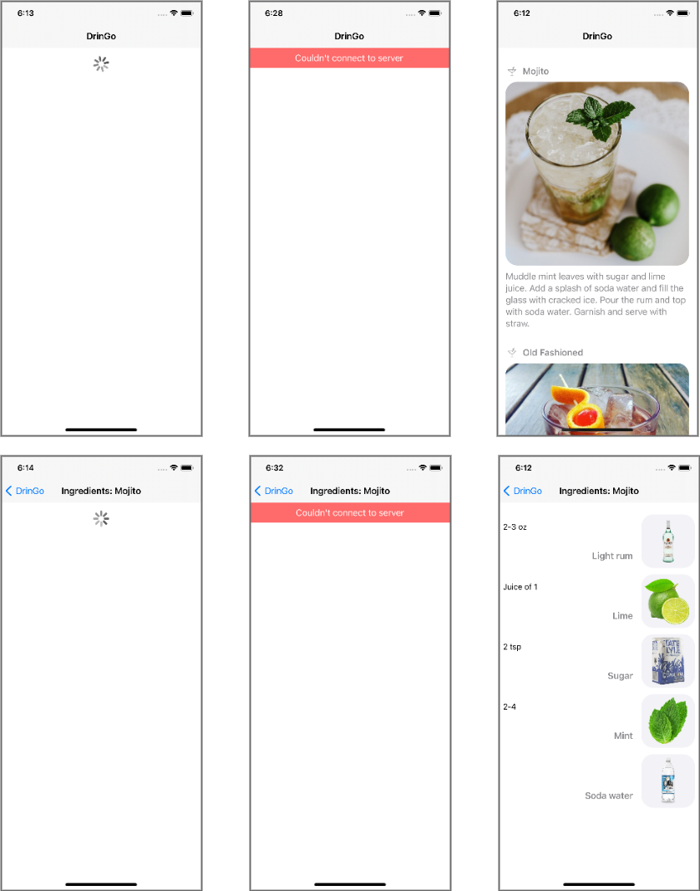
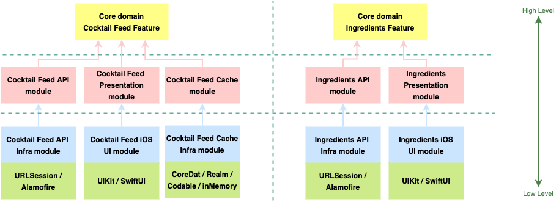
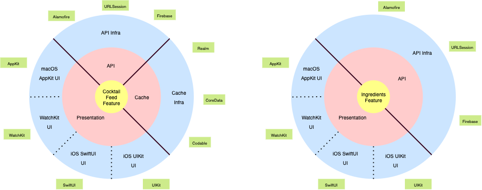
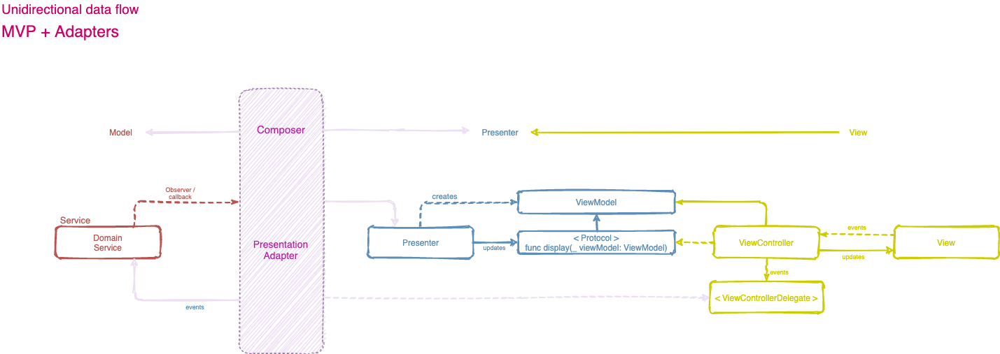
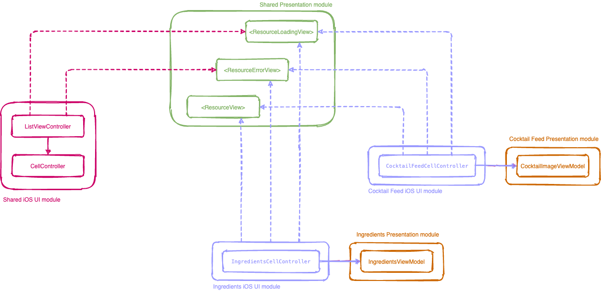
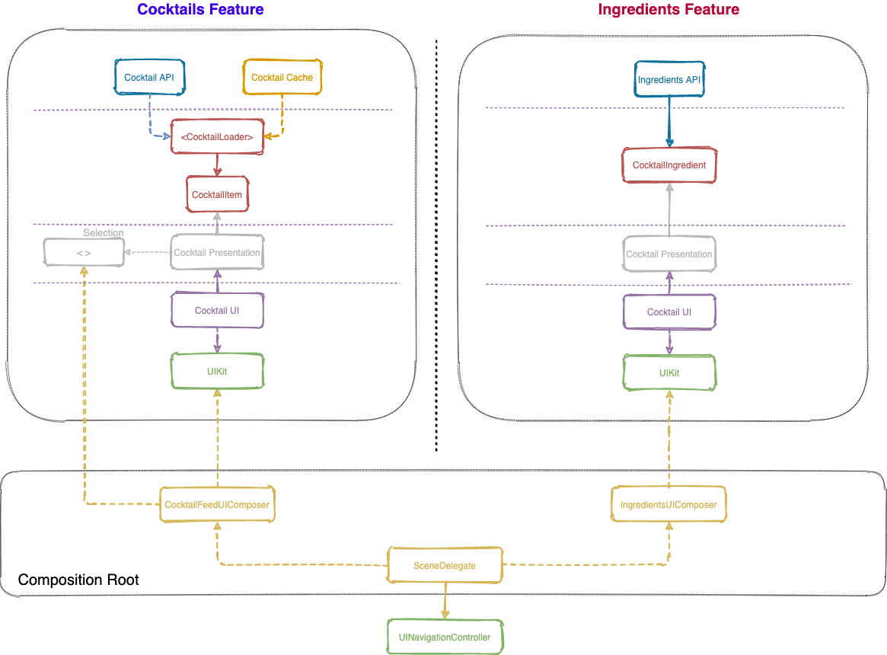

# DrinGo

[](https://travis-ci.org/fvegagiga/DrinGo)

**DrinGo** is a native **iOS app** to discover cocktails and drinks recipes.
The app displays a list of the most popular cocktails. The user can select any of them and  check the ingredients to make his own tasty and refreshing drink. 

Language: Swift 5
Xcode version: 12.5.1
iOS deployment target: 14.0




## Codebase organization

DrinGoApp is a workspace composed of two projects:

The first one, **DrinGoFeed**, is composed of two targets (frameworks):
- DrinGoFeed, for platform agnostic components;
- DrinGoFeediOS, for platform specific components, like the UI.

The second one, **DrinGoApp**, is the app specific project. It has one iOS app target, that depends on the previous frameworks (DrinGoFeed & DrinGoFeediOS).
Here is where the Composition Root is, that composes the platform agnostic with the platform specific modules.

The app is organised in a modular setup consisting of a **horizontal layer slicing** within **vertical  feature slicing**, where the features don’t know about each other.



Here’s how both, Cocktail Feed and Ingredients Features, look like  in a circular diagram:




## UI pattern - MPV with unidirectional data flow:

The chosen UI pattern has been the MVP with a variation to establish a unidirectional communication channel between the Presenter and the View through an Adapter.



The Presenter doesn’t need to communicate with the domain services (such as the <Loader>), making the Presenter much leaner as it will have no state management logic.
Also, the View layer doesn’t need to communicate directly with the Presenter, increasing the system composability. The View delegates messages via a protocol.
A Composition Adapter is responsible for connecting the interfaces. The Adapter conforms to the *ViewDelegate* and translates View events to Domain commands/requests delegating responses and state transitions to the Presenter.

This MVP variation is more complex than others, what make it more reusable and modules more isolated.

Separating all view methods in different View protocols might make the code more composable. However, the project might end up with dozens of View protocols, which will make the codebase harder to understand and maintain.



Thus, it’s important to find a good balance depending on the project needs.


### Story: Customer requests to list popular cocktails

### Narrative #1

```
As an online customer
I want the app to automatically load a popular cocktail list
So I can always enjoy a new cocktail
```

### Scenarios (Acceptance criteria)

```
Given the customer has connectivity
 When the customer requests to load a popular cocktail list
 Then the app should display the cocktail list from remote
  And replace the cache with the new list
```

### Narrative #2

```
As an offline customer
I want the app to show the latest saved version of my cocktail list
So I can always enjoy some cocktails
```

### Scenarios (Acceptance criteria)

```
Given the customer doesn’t have connectivity
  And there’s a cached version of the cocktail list
  And the cache is less than seven days old
 When the customer requests to see the list
 Then the app should display the latest list saved
 
 Given the customer doesn’t have connectivity
   And there’s a cached version of the cocktail list
   And the cache is seven days old or more
  When the customer requests to see the list
  Then the app should display an error message

Given the customer doesn’t have connectivity
  And the cache is empty
 When the customer requests to see the cocktail list
 Then the app should display an error message
```

## Use Cases

### Load Cocktails From Remote Use Case

#### Data:
- URL

#### Primary course (happy path):
1. Execute "Load Cocktail Items" command with above data.
2. System downloads data from the URL.
3. System validates downloaded data.
4. System creates feed items from valid data.
5. System delivers feed items.

#### Invalid data - error course (sad path):
1. System delivers invalid data error.

#### No connectivity - error course (sad path):
1. System delivers connectivity error.

---

### Load Cocktail Image Data From Remote Use Case

#### Data:
- URL

#### Primary course (happy path):
1. Execute "Load Image Data" command with above data.
2. System downloads data from the URL.
3. System validates downloaded data.
4. System delivers image data.

#### Cancel course:
1. System does not deliver image data nor error.

#### Invalid data – error course (sad path):
1. System delivers invalid data error.

#### No connectivity – error course (sad path):
1. System delivers connectivity error.

---

### Load Cocktails From Cache Use Case

#### Primary course (happy path):
1. Execute "Load Cocktail Items" command with above data.
2. System retrieves feed data from cache.
3. System validates cache is less than seven days old.
4. System creates feed items from valid data.
5. System delivers feed items.

#### Retrieval error course (sad path):
1. System delivers error.

#### Expired cache course (sad path):
1. System delivers no feed items.

#### Empty cache course (sad path):
1. System delivers no feed items.

---

### Load Cocktail Image Data From Cache Use Case

#### Data:
- URL

#### Primary course (happy path):
1. Execute "Load Image Data" command with above data.
2. System retrieves data from the cache.
3. System delivers cached image data.

#### Cancel course:
1. System does not deliver image data nor error.

#### Retrieval error course (sad path):
1. System delivers error.

#### Empty cache course (sad path):
1. System delivers not found error.

---

### Validate Feed From Cache Use Case

#### Primary course (happy path):
1. Execute "Validate Cache" command with above data.
2. System retrieves feed data from cache.
3. System validates cache is less than seven days old.

#### Retrieval error course (sad path):
1. System deletes cache.

#### Expired cache course (sad path):
1. System deletes cache.

---

### Cache Cocktails Use Case

#### Data:
- Cocktail items

#### Primary course (happy path):
1. Execute "Save Cocktail Items" command with above data.
2. System deletes old cache data.
3. System encodes feed items.
4. System timestamps the new cache.
5. System saves new cache data.
6. System delivers success message.

#### Deleting error course ( sad path):
1. System delivers error.

#### Saving error course ( sad path):
1. System delivers error.

---

### Cache Cocktail Image Data Use Case

#### Data:
- Image Data

#### Primary course (happy path):
1. Execute "Save Image Data" command with above data.
2. System caches image data.
3. System delivers success message.

#### Saving error course (sad path):
1. System delivers error.

---

## Ingredients Feature Specs

### Story: Customer requests to see drink's ingredients

### Narrative

```
As an online customer
I want the app to load ingredients
So I can see the cocktail recipe
```

#### Scenarios (Acceptance criteria)

```
Given the customer has connectivity
 When the customer requests to see the cocktail ingredients
 Then the app should display all the ingredients for that cocktail
```

```
Given the customer doesn't have connectivity
 When the customer requests to see the cocktail ingredients
 Then the app should display an error message
```

## Use Cases

### Load Drink Ingredients From Remote Use Case

#### Data:
- ingredient name

#### Primary course (happy path):
1. Execute "Load Ingredients" command with above data.
2. System loads data from remote service.
3. System validates data.
4. System creates ingredients from valid data.
5. System delivers ingredients.

#### Invalid data – error course (sad path):
1. System delivers invalid data error.

#### No connectivity – error course (sad path):
1. System delivers connectivity error.

---

## Architecture


