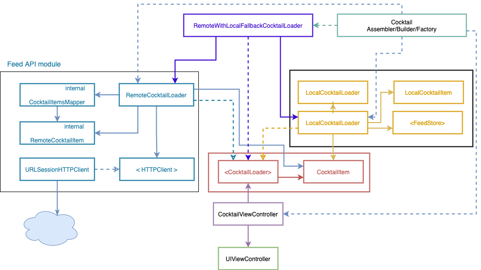

# DrinGo

[](https://travis-ci.org/fvegagiga/DrinGo)

DrinGo is an iOS app to discover the best cocktails and drink recipes.


### Story: Customer requests to see a random cocktail list

### Narrative #1

```
As an online customer
I want the app to automatically load a random cocktail list
So I can always enjoy a new cocktail
```

### Scenarios (Acceptance criteria)

```
Given the customer has connectivity
 When the customer requests to load a random cocktail list
 Then the app should display the cocktail list from remote
  And replace the cache with the new list
```

### Narrative #2

```
As an offline customer
I want the app to show the latest saved version of my cocktail list
So I can always enjoy some cocktails
```

### Scenarios (Acceptance criteria)

```
Given the customer doesn’t have connectivity
  And there’s a cached version of the cocktail list
  And the cache is less than seven days old
 When the customer requests to see the list
 Then the app should display the latest list saved
 
 Given the customer doesn’t have connectivity
   And there’s a cached version of the cocktail list
   And the cache is seven days old or more
  When the customer requests to see the list
  Then the app should display an error message

Given the customer doesn’t have connectivity
  And the cache is empty
 When the customer requests to see the cocktail list
 Then the app should display an error message
```

## Use Cases

### Load Cocktails From Remote Use Case

#### Data:
- URL

#### Primary course (happy path):
1. Execute "Load Cocktail Items" command with above data.
2. System downloads data from the URL.
3. System validates downloaded data.
4. System creates feed items from valid data.
5. System delivers feed items.

#### Invalid data - error course (sad path):
1. System delivers invalid data error.

#### No connectivity - error course (sad path):
1. System delivers connectivity error.

---

### Load Cocktail Image Data From Remote Use Case

#### Data:
- URL

#### Primary course (happy path):
1. Execute "Load Image Data" command with above data.
2. System downloads data from the URL.
3. System validates downloaded data.
4. System delivers image data.

#### Cancel course:
1. System does not deliver image data nor error.

#### Invalid data – error course (sad path):
1. System delivers invalid data error.

#### No connectivity – error course (sad path):
1. System delivers connectivity error.

---

### Load Cocktails From Cache Use Case

#### Primary course (happy path):
1. Execute "Load Cocktail Items" command with above data.
2. System retrieves feed data from cache.
3. System validates cache is less than seven days old.
4. System creates feed items from valid data.
5. System delivers feed items.

#### Retrieval error course (sad path):
1. System delivers error.

#### Expired cache course (sad path):
1. System delivers no feed items.

#### Empty cache course (sad path):
1. System delivers no feed items.

---

### Load Cocktail Image Data From Cache Use Case

#### Data:
- URL

#### Primary course (happy path):
1. Execute "Load Image Data" command with above data.
2. System retrieves data from the cache.
3. System delivers cached image data.

#### Cancel course:
1. System does not deliver image data nor error.

#### Retrieval error course (sad path):
1. System delivers error.

#### Empty cache course (sad path):
1. System delivers not found error.

---

### Validate Feed From Cache Use Case

#### Primary course (happy path):
1. Execute "Validate Cache" command with above data.
2. System retrieves feed data from cache.
3. System validates cache is less than seven days old.

#### Retrieval error course (sad path):
1. System deletes cache.

#### Expired cache course (sad path):
1. System deletes cache.

---

### Cache Cocktails Use Case

#### Data:
- Cocktail items

#### Primary course (happy path):
1. Execute "Save Cocktail Items" command with above data.
2. System deletes old cache data.
3. System encodes feed items.
4. System timestamps the new cache.
5. System saves new cache data.
6. System delivers success message.

#### Deleting error course ( sad path):
1. System delivers error.

#### Saving error course ( sad path):
1. System delivers error.

---

## Architecture


